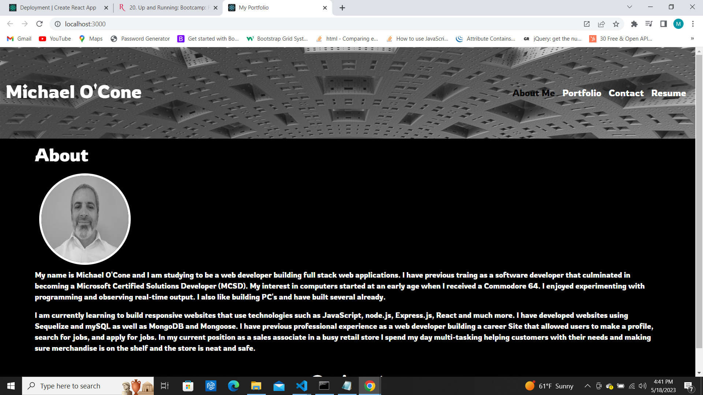

# TechBlog

## Description
Allows users to view my portfolio and see the projects that I have worked on.  I built this using a black and white theme.  My motivation was to have users get a glimse of who I am and my coding style.

## Table of Contents
- [TechBlog](#techblog)
  - [Description](#description)
  - [Table of Contents](#table-of-contents)
  - [Installation](#installation)
  - [Usage](#usage)
  - [Licence](#licence)
  - [Contributing](#contributing)
  - [Tests](#tests)
  - [Questions](#questions)
  - [Screenshot](#screenshot)
  - [Link to Github repository](#link-to-github-repository)
  - [Link to Deployed Website](#link-to-deployed-website)

## Installation
Navigate to the webpage.
## Usage
After navigating to the webpage users are presented with a navigation header, about section and footer. There are 4 sections. Users can go to about section, portfolio section, contact section, and resume section by clicking the links in the navigation. On the portfolio section users can view projects that worked on.  When users hover over the image of the project, the project name, a github icon, and technologies used appear. A user can navigate to the deployed application by clicking on the project name. Users can also navigate to the projects github repo by clicking the github icon.
## Licence
This project uses the [MIT](https://opensource.org/license/mit/) license.

## Contributing
If you would like to contribute to this project email me at the address below.
## Tests
None at this time.
## Questions
If you have any questions you can contact me at [michaeloc@verizon.net](michaeloc@verizon.net)  
Visit me at [Github](https://github.com/michaeloc1)
## Screenshot

## Link to Github repository
[Link](https://github.com/michaeloc1/portfolio) to Github repository.
## Link to Deployed Website
[Link](https://michaeloc1.github.io/portfolio/) to deployed website.
